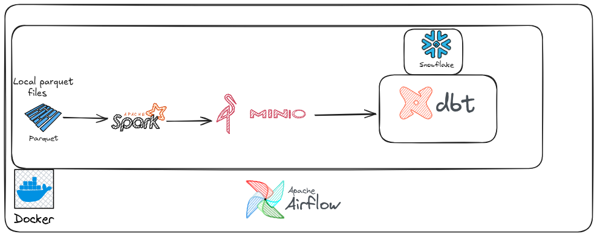
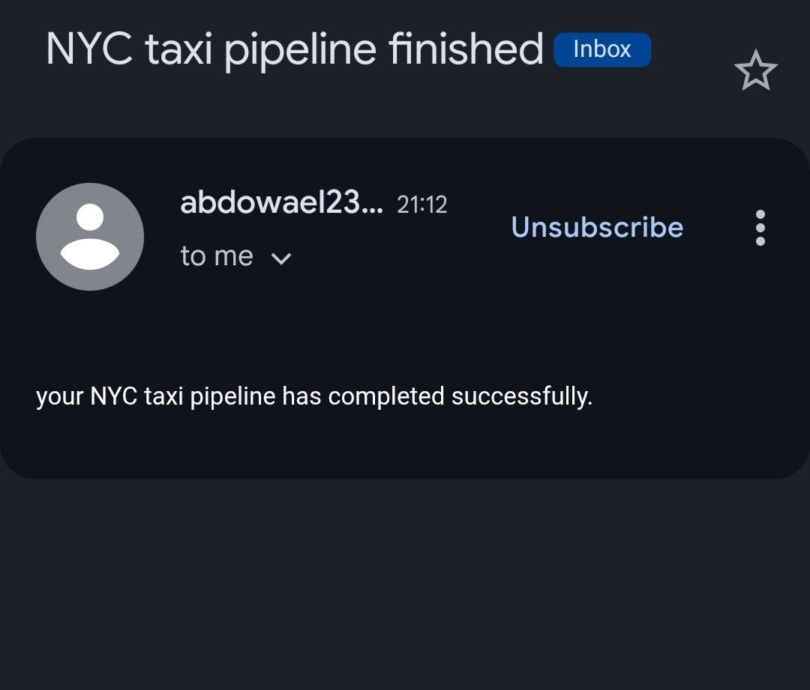
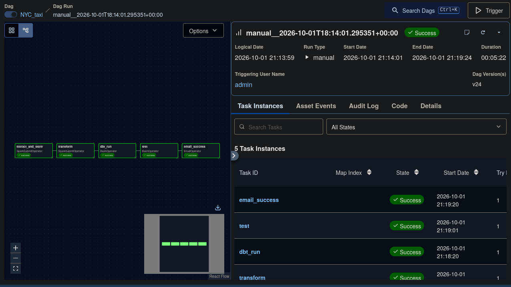

# NYC Taxi Pipeline

An Apache Airflow data pipeline for 2026 NYC yellow taxi trips. The project uses
Apache Spark for ingestion and data quality processing, MinIO as S3-compatible
object storage, dbt for Snowflake transformations, and Brevo SMTP for pipeline
completion notifications.

## Architecture


The scheduled Airflow DAG, `NYC_taxi`, runs this chain:

```text
Parquet files -> Spark -> MinIO raw_data
															|
															v
												 Spark quality checks
												 |              |
										transformed/     rejected/
															|
															v
												 dbt on Snowflake
												 silver -> gold -> tests
															|
															v
												 SMTP notification
```

### Services

| Service | Purpose | Local endpoint |
| --- | --- | --- |
| `airflow-apiserver` | Airflow web UI and API | <http://localhost:8080> |
| `airflow-scheduler` | Schedules and runs tasks | Internal |
| `airflow-dag-processor` | Parses DAG files | Internal |
| `postgres` | Airflow metadata database | Internal |
| `spark-master` | Spark cluster master | <http://localhost:8081> |
| `spark-worker` | Spark execution worker | Internal |
| `minio` | S3-compatible storage | <http://localhost:9000> |
| `minio` console | Object storage console | <http://localhost:9001> |
| `dbt` | Interactive dbt container | Internal |

## Prerequisites

- Docker Engine with Docker Compose
- A Snowflake account with a database and schema
- A Brevo SMTP account, if email notifications are required
- 2026 yellow taxi Parquet files in `data/`, matching `yellow_tripdata_2026-*.parquet`
- `data/taxi_zone_lookup.csv`

## Configuration

Create a private environment file from the committed template:

```bash
cp .env.example .env
```

Fill in `.env` with real values. The following variables are required:

| Variable group | Variables |
| --- | --- |
| MinIO | `MINIO_ACCESS_KEY`, `MINIO_SECRET_KEY` |
| Snowflake | `SNOWFLAKE_ACCOUNT`, `SNOWFLAKE_USER`, `SNOWFLAKE_PASSWORD`, `SNOWFLAKE_ROLE`, `SNOWFLAKE_WAREHOUSE`, `SNOWFLAKE_DATABASE`, `SNOWFLAKE_SCHEMA` |
| Airflow security | `AIRFLOW_JWT_SECRET`, `AIRFLOW_FERNET_KEY` |
| Brevo SMTP | `BREVO_SMTP_LOGIN`, `BREVO_SMTP_KEY` |

Never commit `.env`, Snowflake credentials, SMTP keys, or Fernet keys. The
repository ignores `.env` and includes only placeholder values in `.env.example`.

dbt also requires a local `profiles.yml` for the `nyc_taxi` profile. Keep this
file outside version control and configure it to read the Snowflake values from
the environment.

## Start the stack

Build and start all services:

```bash
docker compose up -d --build
```

Open Airflow at <http://localhost:8080>. The development initialization creates
the user `admin` with password `admin`; change this before using the deployment
outside a local environment.

Check service status and logs with:

```bash
docker compose ps
docker compose logs -f airflow-scheduler
```

## SMTP connection

The DAG expects the Airflow connection ID `smtp`. After starting the stack,
create it using the credentials already injected into the scheduler container:

```bash
docker compose exec airflow-scheduler airflow connections add smtp \
	--conn-type smtp \
	--conn-host smtp-relay.brevo.com \
	--conn-port 587 \
	--conn-login "$(docker compose exec airflow-scheduler printenv BREVO_SMTP_LOGIN)" \
	--conn-password "$(docker compose exec airflow-scheduler printenv BREVO_SMTP_KEY)" \
	--conn-extra '{"disable_ssl": true, "from_email": "your-email@example.com"}'
```


The backslash must be the final character on each continued shell line. Do not
use `smtp_default` unless the DAG is changed to use that connection ID.

## Run the pipeline

Trigger the complete DAG manually:

```bash
docker compose exec airflow-scheduler airflow dags trigger NYC_taxi
```

To test only the email task without running Spark or dbt:

```bash
docker compose exec airflow-scheduler airflow tasks test NYC_taxi email_success 2026-10-01
```

To inspect the DAG and task list:

```bash
docker compose exec airflow-scheduler airflow dags list
docker compose exec airflow-scheduler airflow tasks list NYC_taxi
```

## Pipeline components

- `spark_apps/to_minio.py` reads local 2026 taxi Parquet files and writes
	`s3a://nyctaxidata/raw_data/`.
- `spark_apps/silver.py` applies null, range, timestamp, payment, and fare
	quality rules. Valid rows go to `transformed/`, rejected rows go to
	`rejected/`, and taxi zones go to `lookup/`.
- `dbt_project/nyc_taxi` builds silver views and gold tables in Snowflake,
	including trip, location, and date models.
- `dbt_project/nyc_taxi/tests` contains dbt data-quality tests.
  Dag run :
  
